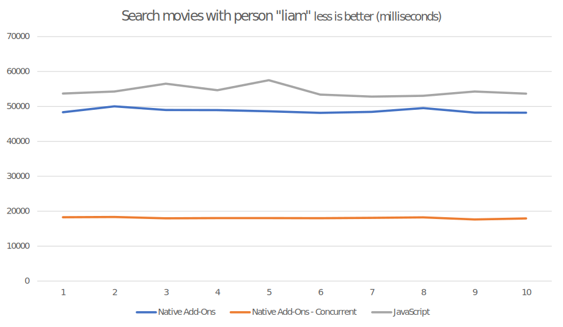

# electronjs-with-rust-performance

Performance test for Electron.js using:

-   Only JavaScript
-   Native _Add-Ons_ with Rust
-   WebAssembly with Rust

## Motivation

_Electron.js_ application's performance can degrade over time, specially when dealing with a lot of
data, intensive computations or just keep adding more and more features to an app. This repository
attempts to test possible performance gains using Rust in various flavors: Using native _Add-Ons_
with [neon](https://neon-bindings.com/) and using [WebAssembly](https://webassembly.org/).

This technically would turn a JavaScript application into a Native/Hybrid application and the
complexity will possibly be greater, but it allows to keep using web technologies to handle the UI
and handle _most_ of the business logic with Rust.

And although this can also be achieved with C++, Rust has better ergonomics and its technically
easier for new starters to jump into, as well as being
[safer](https://msrc-blog.microsoft.com/2019/07/22/why-rust-for-safe-systems-programming/). And
let's not forget that Rust is the
[most loved language for 5th year in a row](https://insights.stackoverflow.com/survey/2020#most-loved-dreaded-and-wanted).

## What is measured?

The "easiest" way to test for performance is to build a regular application for each use-case and
check differences in them. This experiment consists in three different applications: One built with
only JS, one with Native _Add-Ons_ using Rust and the last using WebAssembly, also with Rust.

Each application just calls a very big _SQLite_ Database and makes different queries and renders the
data. The idea is to make an application as it was a real thing and not a synthetic test.

The parameters to measure are:

-   Execution time
-   Memory consumed
-   Bundle size

## About the data

The data is about 192MB of imdb data (in a SQLite DB), which was gotten originally from
[kaggle](https://www.kaggle.com/stefanoleone992/imdb-extensive-dataset) but the data used here
is a bit modified to adapt it into SQLite, but the information itself should be the exact same.

And _why imdb?_ you might ask. Well I first tried with a
[league of legends data set](https://www.kaggle.com/paololol/league-of-legends-ranked-matches), but
the data was incomplete/broken so I went with the second option (╯°□°）╯︵ ┻━┻)

## About the Applications

The applications built use the data previously described and make two different queries:

-   Search movies using a person's name.
-   Search movies where actresses are taller than the person being searched.

Both queries are simple enough and try to imitate a regular application usage. No pagination is
being used and no joins (this is suggested
[here](https://github.com/petehunt/rowrm#why-cant-i-do-joins)), which may be a bad idea in some
scenarios, but in this case I was trying to put some pressure in the application to get significant
enough numbers.

## Repository structure

Note: **bold** items are the applications (which is the part that this projects measures). And the
_italic_ items are only meant for supporting the main code, could be considered a kind of
boilerplate or base for the _Electron.js_ applications.

-   **electron-js-app:** Application using only JavaScript Code
-   **electron-neon-app:** _Electron.js_ Application using the Native _Add-Ons_
-   **electron-webassembly-app:** Not implemented yet...
-   _rust-core:_ Code that is used in _Add-Ons_ and WebAssembly implementation for rust.
-   _neon-bindings:_ Native _Add-Ons_ (bindings) to be used in a _Node.js_ or _Electron.js_
    application.
-   _wasm_: Code that binds the _rust-core_ crate and exposing functions with WebAssembly, similar
    to _neon-bindings_

## About the Results

Unfortunately, at this moment I'm unable to compile the WebAssembly that would had been used by
an Electron.js Application to add its results. I'm sure it will be possible at some point and I
can run the tests again.

The machine being used to run the tests is:

-   Intel i7-10750H
-   16GB RAM
-   Windows 10 Pro version 2004

## CPU Results

The two exact queries were performed in the JavaScript-Only Application as well as the one with
Native Add-Ons. And as a small bonus, the second application has a mode to run the same queries but
in a concurrent mode, so it uses all the available processors of the machine.

### Searching movies by person's name

### Searching movies that have taller actresses than the person being searched

## RAM Results

Measuring RAM Usage may need some improvements and measure again. For now, only the RAM usage in
V8 is measured. This because I'm not sure how to _accurately measure it_.

The measurements were done by doing the same set of queries in the same order, so there could be a
somewhat similar scenario. Also, the data is captured as soon as the results of the queries is
gotten in the Node.js thread. Measurements in the Chromium side were not done, as it should be the
exact same.

## Disk Usage

The disk is measured by checking the size of the artifacts produced by: Bundling the code &
packaging the final binary for installation.

## Conclusions

Rust can be used to improve performance in an Electron.js Application. There are two possible ways
of doing that: Using Native Add-Ons or WebAssembly. The former has better support, as it uses the
same API that Node.js uses to consume its native dependencies, so using this method, it's possible
to use any native dependency and all the cores of a computer. The latter is newer and it's easier
to integrate in JavaScript as it can be used in Node.js or Chromium, but there's a lot of rough
edges as today (August 13th 2020). Using native sub-dependencies is tricky (I can't compile this
code for WebAssembly for example) and there's plan to have multi-thread support, but is not possible
today.

For a Node.js Application or if a native sub-dependency is used, then using Native Add-Ons is
recommended. If the implementation needs to be used in Chromium or if the crate has no
native sub-dependencies, then WebAssembly is fine.

The performance gains that is significant enough is in the CPU, both RAM & Disk usage didn't seem
to have huge benefits. However, in some cases V8 had almost the exact same performance as Rust,
unless the code is using a multi-threaded approach. In the best case scenario, Rust is able to have
a 10x performance gain (A whole order of magnitude!) and in the worst case it's a 3x performance
gain. Of course this numbers may change depending on specific implementation, but it's something
noticeable.

## How to run locally

1.  The first thing to do is to create the database itself. Go to [rust-core](./rust-core) and
    follow the instructions to initialize database.
1.  Run electron js application following instructions in [electron-js-app](./electron-js-app)
1.  Run neon application following instructions in [electron-neon-app](./electron-neon-app)

## Applications Architecture

### electron-js-app

### electron-neon-app

### electron-wasm-app

## References

Some research papers/articles/talks with different numbers & applications can be read in:

-   [https://sci-hub.tw/https://doi.org/10.1007/978-3-319-92375-8_15](https://sci-hub.tw/https://doi.org/10.1007/978-3-319-92375-8_15)
-   [https://mnt.io/2018/08/22/from-rust-to-beyond-the-webassembly-galaxy/](https://mnt.io/2018/08/22/from-rust-to-beyond-the-webassembly-galaxy/)
-   [https://www.youtube.com/watch?v=lLzFJenzBng](https://www.youtube.com/watch?v=lLzFJenzBng)
-   [http://www.sable.mcgill.ca/publications/techreports/2018-2/techrep.pdf](http://www.sable.mcgill.ca/publications/techreports/2018-2/techrep.pdf)
