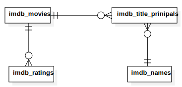

# Rust Core

This is the base code that can be reused in the _Add-On_ and _WebAssembly_ implementation. It has
the details for the database & basic utilities that can be reused across projects.

## Requirements

-   Rust >= 1.45
-   SQLite >= 3
-   Diesel CLI (More info [here](https://diesel.rs/guides/getting-started/))

## Setup

Duplicate the `.env.example` file and name it `.env`. It contains the environment variables needed
to run the project.

For Linux an Mac OSX

```bash
./scripts/init.sh
```

For Windows

```powershell
.\scripts\init.bat
```

## Specifications

### Database model

Here's the Entity Relation model for the database.



Original data is gotten from [kaggle](https://www.kaggle.com/paololol/league-of-legends-ranked-matches)
but the `.csv` files are a bit different from original source:

-   Removed header from csv files to be able to import them with `sqlite3`.
-   Added extra column in `teambans` and `teamstats` to act as an id, because `matchid` can't act as
    a primary key in those tables. `diesel` requires the tables to have a primary key, so I added a
    simple auto-increment column.
